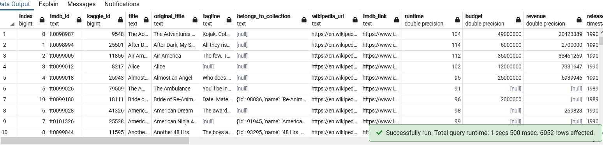

# Movies_ETL

### Purpose
  The purpose of this analysis was to assit Britta in an ETL process with Amazing prime to prepare usable data for Hackathon that they are hosting. Movie data from three sources would have to be extracted, transformed, and loaded into PostgreSQL. The data comes from Wikipedia and Kaggle, notably using the movie dataset, and 2 cvs files with movie data and ratings data. The following analysis was completed using code done previously in the module and refactoring for the challenges requirements, including making a function that take in 3 file variables and reading them.
### Example

